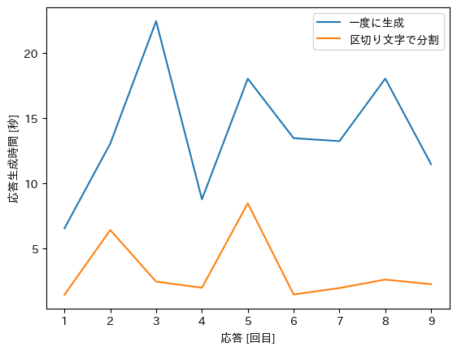

# hagi-bot

## 概要
このリポジトリには，[対話システムライブコンペティション6](https://sites.google.com/view/dslc6/%E3%83%9B%E3%83%BC%E3%83%A0)に提出し，予選を1位で通過した対話システム「hagi-bot」のモデルの詳細が記述されたスクリプト及び本システムで行った実験結果が含まれています．

## 配布リソースに関する説明
本システムはマルチモーダル対話システムであり，アバターを動かすには運営から配布されたソフトウェアが必要となります．配布ソフトウェアの必要ないテキストベースで応答生成するローカルモデルを追加で公開します．

本コンペティションに提出したマルチモーダルモデルについては multimodal フォルダで公開します．

テキストベースで応答生成するローカルモデルについては local フォルダで公開します．

### 応答生成機構
本システムでは対話状態をスロットフィリング形式で監視し，状況に応じてプロンプトを変更し続けることで，文脈を考慮した自然な議論の展開を可能にしています．
応答生成とスロットフィリングには OpenAI 社が公開している GPT-4 を用いています．
本システムを実行するには OpenAI API が必要です．OPENAI_API_KEY を自身の API キーに変更してください．

#### OpanAI API キーの指定方法
1. ~/.zshrc で指定する場合
   ~/.zshrc に以下を記述してください．
   ```
   export OPENAI_API_KEY="[自身のOpenAI API キー]"
   ```

2. 直接コード上で指定する場合
   [このファイル](./local/run.py)の35行目 (main関数の１行目) を以下に書き換えてください
   ```
   openai.api_key = "[自身のOpenAI API キー]"
   ```

#### プロンプト
プロンプト内容は[こちら](./local/clients/prompts/system_instructions.py)で確認できます．

### 利用方法
#### マルチモーダルモデルの実行方法
[こちら](https://sites.google.com/view/dslc6/getting-started)こちらを参考にしてください．

#### ローカルモデルの実行方法
実行環境
- Python 3.10
- openai == 0.28.1
- tiktoken == 0.5.1
- timeout_decorator == 0.5.0

```
# リポジトリのクローン
git clone https://github.com/cl-tohoku/hagi-bot.git
cd hagi-bot/local

# ライブラリのインストール
pip install -r requirements.txt

# モデルとコマンドラインで対話 (--debug を指定することで生成時間やスロット内容を確認できます)
python run.py --stream --main-model gpt-4 --slot-model gpt-4
```

#### コマンドライン引数についての補足
|コマンドライン引数|概要|
| ---- | ---------- |
|stream|生成方法の変更|
|main-model|応答生成モデルの指定|
|slot-model|スロットモデルの指定|
|debug|生成時間やスロットの確認|

- stream
  - 応答を一度に生成するか，区切り文字(、。?!…)毎に生成するかを指定します
  - --stream 無：一度に生成
  - --stream 有：区切り文字毎に生成
- main-model
  - 応答生成モデルを指定します
  - --main-model gpt-3.5-turbo：GPT-3.5-turbo を指定
  - --main-model gpt-4：GPT-4を指定
- slot-model
  - 応答生成モデルを指定します
  - --slot-model gpt-3.5-turbo：GPT-3.5-turbo を指定
  - --slot-model gpt-4：GPT-4を指定
- debug
  - 生成時間やスロットの確認をするデバッグモードにします
  - --debug 無：ユーザとシステムの応答のみ表示
  - --debug 有：応答生成時間，スロット内容などを表示

## 実験結果の詳細
### 実験内容
応答を一度に生成する場合と，区切り文字(、。?!…)毎に生成する場合の最初の応答時間の比較を行った．

### 実験設定
- ローカルモデルを用いて計測した
- 応答生成モデルとスロットモデルは GPT-4 を使用した
- １対話 (９応答) 分の応答生成時間を計測した

### 実験結果


一度に生成したときの平均時間は 13.88 秒であり，
区切り文字毎に生成したときの平均時間は 3.22 秒 だった．

### 考察
一度に生成するよりも，区切り文字毎に生成する場合の方が，10秒以上短くなった．これは応答生成時間が生成した文の長さに依存していることに起因していると考えられる．

また，同じモデルの生成時間の差が大きいのは，サーバとの接続状況や混雑状況によるものだと考えられる．3 回目の応答に注目すると，一度に生成する場合は 20 秒以上かかっているが，区切り文字毎に生成する場合は 2 秒程度で済んでいる．ここから，応答生成の途中で長時間の応答生成が行われていることになる．マルチモーダルモデルを使う時，一度に生成する場合はユーザに長い待ち時間が発生してしまうが，区切り文字で分割する場合は生成しながらシステムに発話させることによって応答生成の待ち時間をユーザに感じさせない工夫をしている．

## ライセンス
The models are distributed under the terms of the [Creative Commons Attribution-ShareAlike 3.0](https://creativecommons.org/licenses/by-sa/3.0/).

The source code is licensed MIT.


## 引用
引用される方は，以下の文献を引用していただけると幸いです．

```
@inproceedings{hagi-bot,
author={中野雄斗 and 野末慎之介 and 穀田一真 and 有山知希 and 佐藤魁 and 曾根周作 and 亀井遼平 and 謝素春 and 成田風香 and 守屋彰二 and 赤間怜奈 and 松林優一郎 and 坂口慶祐},
title={Hagi bot: LLMを用いた対話状態追跡と人間らしい振る舞いで自然な議論を行うマルチモーダル対話システム},
booktitle={第99回人工知能学会 言語・音声理解と対話処理研究会(第14回対話システムシンポジウム)},
year={2023}
}
```

## 連絡先
ご質問等ございましたら，nakano.yuto.t2@dc.tohoku.ac.jpまたはnozue.shinnosuke.q5@dc.tohoku.ac.jpへお問い合わせください．

